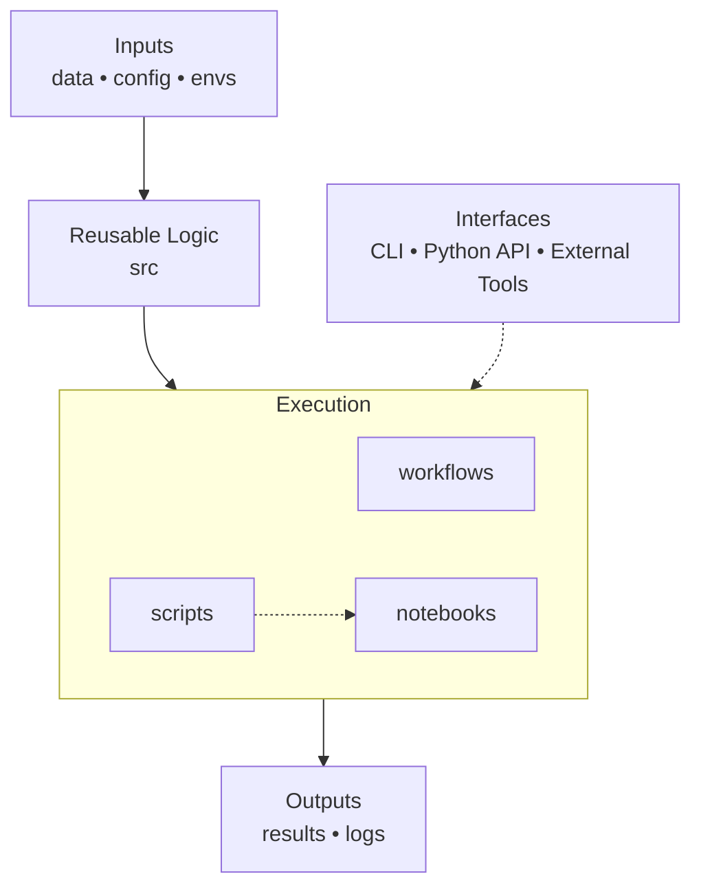
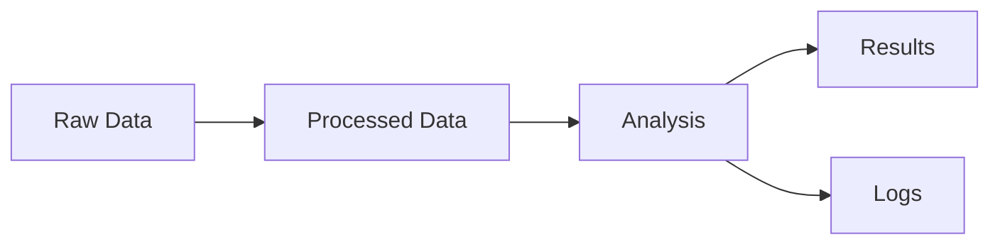

# Scientific Computing Project Template

## Overview

This repository provides a modular, reproducible framework for computational research across any data-driven scientific domain.

It is designed for projects involving:
- structured datasets
- computational analysis
- statistical inference or machine learning
- reproducible workflows
- scalable execution (local, HPC, or cloud)

The system is intentionally **domain-agnostic** and does not assume any specific scientific field.

---

## Core Philosophy

This framework is built around a simple model:

> **Data defines inputs**
> **Code defines transformations**
> **Workflows define execution**
> **Results define outputs**

Everything in the repository maps cleanly to one of these roles.

---

## System Architecture

### High-level structure



---

### Data lifecycle



---

## Repository Structure

```
config/        → configuration and parameter definitions
data/          → all datasets (raw, processed, external, reference)
envs/          → computational environments and dependencies

src/           → reusable computational logic (scientific core)
workflows/     → pipeline orchestration (Nextflow, Snakemake, DAGs)

interfaces/    → user-facing entry points (CLI, APIs)
scripts/       → lightweight execution wrappers
notebooks/     → exploratory and narrative analysis

results/       → outputs generated from computation
logs/          → execution logs and runtime traces

tests/         → validation and correctness checks
docs/          → documentation and design notes
assets/        → static resources (schemas, templates, configs)
```

---

## File Classification Rules

| Artifact type | Location | Purpose |
|--------------|----------|----------|
| Raw data | `data/raw/` | immutable input |
| Processed data | `data/processed/` | canonical analysis input |
| External data | `data/external/` | third-party datasets |
| Reference data | `data/reference/` | standards / baselines |
| Configuration | `config/` | parameter control |
| Scientific logic | `src/` | reusable computations |
| Pipeline execution | `workflows/` | orchestration |
| Scripts | `scripts/` | lightweight wrappers |
| Interactive analysis | `notebooks/` | exploration |
| Outputs | `results/` | derived artifacts |
| Execution traces | `logs/` | runtime behaviour |

---

## Where should something go?

Use these rules:

### 1. Can it be regenerated exactly?
- Yes → `results/` or `data/processed/`
- No → `data/raw/` or `data/external/`

---

### 2. Is it computation logic or execution?
- Logic → `src/`
- Execution → `workflows/`, `scripts/`

---

### 3. Is it exploratory or communicative?
- Yes → `notebooks/` or `results/reports/`
- No → `src/`

---

## Core Principles

### 1. Separation of concerns

- `data/` → inputs
- `src/` → logic
- `workflows/` → execution
- `results/` → outputs
- `logs/` → traceability

---

### 2. Reproducibility

A result is reproducible if it can be regenerated using:

- fixed configuration (`config/`)
- fixed environment (`envs/`)
- raw or processed data (`data/`)
- source code (`src/`)
- workflow definition (`workflows/`)

---

### 3. Modularity

All components are independently reusable:
- `src/` can be imported anywhere
- workflows can be swapped
- interfaces are thin wrappers

---

## Execution Model

### Supported environments

- local machines
- HPC clusters (SLURM, PBS)
- cloud compute systems

---

### Typical workflow execution

```bash
# Setup environment
conda env create -f envs/environment.yaml
conda activate project_env
```

```bash
# Run workflow
nextflow run workflows/main.nf -params-file config/config.yaml
```

or

```bash
snakemake --configfile config/config.yaml
```

---

## Interfaces

The system provides multiple entry points:

- CLI tools → reproducible execution
- scripts/ → lightweight automation
- notebooks/ → exploratory analysis

All interfaces must call logic from `src/` or `workflows/`.

---

## Testing

```bash
pytest tests/
```

Tests validate:
- correctness of core logic
- configuration integrity
- pipeline execution
- data consistency

---

## Logs

All runtime behaviour is captured in `logs/`:

- pipeline execution logs
- notebook execution traces
- script outputs
- system and environment diagnostics
- data transfer (rsync) logs

Logs are **operational artifacts**, not scientific outputs.

---

## Documentation

- Architecture: `docs/architecture.md`
- Usage: `docs/usage.md`
- Workflows: `docs/workflows.md`
- Development: `docs/development.md`

---

## Key Constraint

> This repository must remain valid across scientific domains.

Therefore:
- no domain-specific assumptions
- no method-specific folder design
- no hardcoded analytical paradigms

---

## Citation

If you use this framework:

> [Insert citation here]

See `CITATION.cff` for formats.
