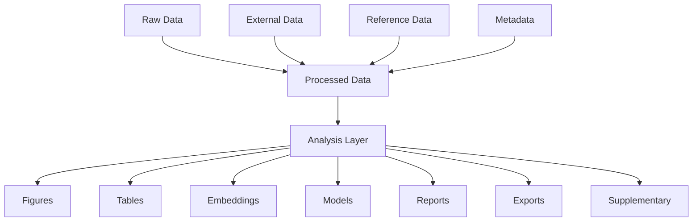

# Results

This directory contains all outputs generated from analyses performed on processed datasets.

It is designed to be **modality-agnostic, method-agnostic, and reproducible**, meaning the structure remains stable regardless of whether the project involves single-cell, spatial, metagenomics, or other omics data.

---

# Core Design Principle

> **`data/` contains persistent datasets used as inputs
> `results/` contains outputs generated from analyses**

- Anything reusable as an input for further analysis belongs in `data/processed/`
- Anything produced by an analysis run belongs in `results/`

This separation ensures clarity between **canonical data** and **derivative outputs**.

---

# Data Flow Overview



---

# Directory Structure

Results are organised by **output type**, not by modality or algorithm.

```text
results/
├── embeddings/
├── exports/
├── figures/
├── models/
├── reports/
├── supplementary/
└── tables/
```

Each directory may optionally contain **subfolders by analysis type** (e.g. `qc/`, `clustering/`, `differential_expression/`) but should not be organised by omics type or method family.

---

# Directory Descriptions

## embeddings/

Low-dimensional representations or latent spaces derived from processed data.

### Examples
- PCA coordinates
- UMAP / t-SNE embeddings
- Harmony embeddings
- scVI latent space
- NicheCompass latent representations

### Rules
- May be stored as standalone files or exported from models
- If embeddings are embedded within canonical datasets (e.g. AnnData), only export here if needed externally
- Organised by analysis type if multiple embeddings exist

---

## exports/

Data prepared for external use or interoperability.

### Examples
- `.h5ad`, `.rds`, `.loom`
- Cellxgene-compatible datasets
- Matrix Market exports
- CSV/TSV datasets for collaborators

### Rules
- Must be reproducible from processed data
- Should not be treated as canonical datasets
- Intended for sharing or cross-tool usage

---

## figures/

Visual outputs generated from analyses.

### Examples
- QC plots
- UMAP visualisations
- Heatmaps
- Volcano plots
- Publication figures

### Rules
- Must be reproducible
- Prefer structured subfolders by analysis type
- Include publication-ready formats where appropriate (PDF/SVG/PNG)

---

## models/

Trained or fitted computational models.

### Examples
- scVI / scANVI models
- CellTypist classifiers
- NicheCompass models
- Machine learning classifiers (RF, XGBoost, etc.)

### Rules
- Must include versioning and training context
- Should record parameters and training dataset provenance
- Prefer reproducibility from processed data

---

## reports/

Rendered analytical summaries.

### Examples
- Quarto / RMarkdown outputs
- HTML notebooks
- QC summaries
- Project reports

### Rules
- Prefer rendered outputs over raw source files
- Should summarise analyses rather than store raw results
- Source notebooks/scripts should live in code directories

---

## supplementary/

Additional outputs not covered by other categories.

### Examples
- Edge-case analyses
- Auxiliary datasets
- One-off exploratory results

### Rules
- Avoid overuse; this should not become a general dumping ground
- If a pattern emerges, promote to a dedicated directory

---

## tables/

Structured tabular outputs from analyses.

### Examples
- Differential expression results
- Marker gene tables
- Cell type proportions
- Summary statistics

### Rules
- Must be machine-readable (CSV, TSV, Parquet preferred)
- Should include metadata sufficient for interpretation
- Must be reproducible from processed data

---

# Organisation Within Directories

Within each directory, results should be organised by **analysis type**, not by omics modality or algorithm.

### Example

```text
results/
├── figures/
│   ├── qc/
│   ├── clustering/
│   └── differential_expression/
│
├── tables/
│   ├── qc/
│   ├── annotation/
│   └── differential_expression/
│
├── embeddings/
│   ├── scrna/
│   └── spatial/
│
└── models/
    ├── scvi/
    └── nichecompass/
```

---

# Key Rules

- Results must always be reproducible from `data/processed/`
- Do not store raw or canonical datasets in `results/`
- Do not organise by modality as the primary structure
- Prefer algorithm-agnostic organisation
- Keep embeddings and models separated by their functional role, not just method name
- Use subdirectories to reflect analysis workflows where needed

---

# Practical Guiding Question

When deciding where a file belongs, ask:

> **“Can I regenerate this exactly from processed data?”**

- Yes → belongs in `results/`
- No → belongs in `data/processed/` or earlier
